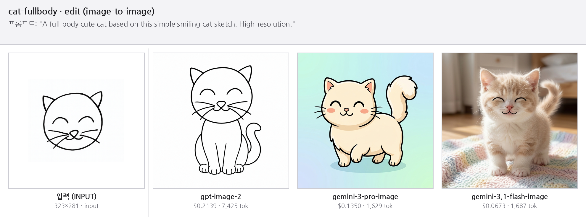

# lab/28 · OpenAI vs Gemini 이미지 생성/편집 비교

OpenAI와 Google Gemini 이미지 모델로 **이미지 생성·편집(image-to-image)**을 해보고, 응답의 **토큰 사용량으로 비용을 직접 계산**해 품질과 가격을 비교하는 실습입니다.

**핵심 테스트 세트** (3개 모델 — 각각 생성·편집 모두 가능):

| 제공자 | 모델 ID | 티어 | 호출 방식 |
|---|---|---|---|
| OpenAI | `gpt-image-2` | flagship | `client.images.edit` |
| Gemini | `gemini-3-pro-image` | Pro | `generate_content` |
| Gemini | `gemini-3.1-flash-image` | Flash | `generate_content` |

> 모델 선정 근거·가격·벤치마크 상세는 [`design/research_models_api.md`](design/research_models_api.md) 참고.

---

## 비교 결과 (스케치 → full-body 고양이 편집)



| 모델 | 입력 토큰 | 출력 토큰 | 합계 | 실제 비용 | 결과 스타일 |
|---|---|---|---|---|---|
| `gpt-image-2` | 401 | 7,024 | 7,425 | **$0.2139** | 입력 라인아트 스타일 유지 (가장 충실) |
| `gemini-3-pro-image` | 277 | 1,246* | 1,629 | **$0.1350** | 컬러 일러스트로 재해석 |
| `gemini-3.1-flash-image` | 277 | 1,410* | 1,687 | **$0.0673** | 포토리얼 사진으로 변환 |

\* Gemini의 출력(candidates) 토큰에는 텍스트가 일부 섞여 있어, 비용은 그중 **이미지 토큰(약 1,120개)**만으로 계산합니다.

---

## 빠른 시작

```bash
uv sync                                       # 의존성 설치
cp .env.example .env                          # OPENAI_API_KEY, GOOGLE_API_KEY 입력
uv run python src/generate_sample.py --list   # 케이스 목록 (API 호출 없음)
uv run python src/generate_sample.py          # 모든 케이스 × 3개 모델 + 비용 표
uv run python src/generate_sample.py cat-fullbody  # 한 케이스만 (비용 절약)
uv run python src/make_montage.py             # 케이스별 비교 뫽타주 생성
```

테스트 케이스(입력 이미지·프롬프트·모델)는 루트 `cases.toml` 에서 추가/수정합니다. `id` 가 `outputs/<id>/` 폴더 이름이 됩니다.

> ⚠️ Gemini 이미지 모델은 **무료 티어가 없습니다** — Google AI Studio에서 결제(유료 티어)를 활성화해야 동작합니다.

---

## 💰 비용은 어떻게 계산하나요? (초보자용)

### 1) "이미지 1장당 얼마"가 아니라 **토큰(token)** 단위로 과금
- **토큰** = AI가 글/이미지를 잘게 나눈 작은 조각.
- **입력 토큰** = 내가 보낸 것 (프롬프트 글자 + 입력 이미지)
- **출력 토큰** = AI가 만든 것 (생성된 이미지)

### 2) 가격은 보통 **"100만(1,000,000) 토큰당 $얼마"**로 공시
예) `gpt-image-2`의 출력 이미지 = **$30 / 1,000,000 토큰**.

### 3) 그래서 비용 공식은 단순합니다
```
비용($) = (토큰 수 ÷ 1,000,000) × (100만 토큰당 단가)
```
입력/출력, 텍스트/이미지처럼 종류가 나뉘면 **각각 계산해서 더합니다.**

### 4) 토큰 수는 "응답"에서 읽습니다 (API는 $금액을 안 줘요!)
| 제공자 | 어디서 읽나 | 주요 필드 |
|---|---|---|
| OpenAI | `response.usage` | `input_tokens`, `output_tokens` (+ 텍스트/이미지 세부) |
| Gemini | `response.usage_metadata` | `prompt_token_count`(입력), `candidates_token_count`(출력) |

두 API 모두 달러 금액은 주지 않으므로, 위 공식으로 **직접 곱해서** 계산합니다. 이 일을 `src/generate_sample.py`가 자동으로 합니다.

### 단가표 (per 1,000,000 tokens · 2026-06-13 공식 확인)
| 모델 | 입력 텍스트 | 입력 이미지 | 출력 이미지 |
|---|---|---|---|
| `gpt-image-2` | $5 | $8 | $30 |
| `gemini-3-pro-image` | \$2 (입력 전체) | — | $120 |
| `gemini-3.1-flash-image` | \$0.5 (입력 전체) | — | $60 |

> Gemini는 입력의 텍스트와 이미지를 합쳐 하나의 입력 단가로 계산합니다.

### 직접 계산해보기 ① — `gemini-3.1-flash-image` (가장 단순)
```
입력 (프롬프트 + 스케치):   277 토큰 × $0.5 ÷ 1,000,000 = $0.000139
출력 (고양이 이미지):     1,120 토큰 × $60  ÷ 1,000,000 = $0.067200
──────────────────────────────────────────────────────────
합계                                                  ≈ $0.0673  ✅
```

### 직접 계산해보기 ② — `gpt-image-2`
```
출력 (이미지):        7,024 토큰 × $30 ÷ 1,000,000 = $0.2107
입력 (텍스트+스케치):    401 토큰  (텍스트 $5·이미지 $8) ≈ $0.0032
──────────────────────────────────────────────────────────
합계                                                ≈ $0.2139  ✅
```

### 왜 OpenAI가 더 비쌌을까?
출력 **이미지 토큰 수**가 훨씬 많기 때문입니다 (7,024 vs 약 1,120). 같은 1024×1024 이미지라도 모델마다 "이미지 1장 = 몇 토큰"이 다르고, 출력 단가도 다릅니다($30 vs $60·$120). 그래서 **토큰 수 × 단가**를 직접 계산하는 것이 핵심입니다.

---

## 폴더 구조
```
.
├── cases.toml                 # 테스트 케이스 메니페스트 (id/type/image/prompt/models)
├── src/
│   ├── generate_sample.py     # 케이스 로드 → 케이스×모델 실행 + 토큰→비용 계산
│   └── make_montage.py        # 케이스별 비교 뫽타주 생성
├── test_data/                 # 입력 이미지들 (cat-scratch.png, woman-masking-book.jpg …)
├── outputs/
│   └── <case-id>/             # 케이스별 결과 png + usage.json + montage.png (실행 시 생성)
├── design/                    # PRD + 모델/가격 리서치 + specs/plans
├── .env.example               # API 키 + 모델 ID 템플릿
└── pyproject.toml
```

> 결과 `*.png` 와 `outputs/<case-id>/usage.json` 은 git 에 추적됩니다 (README 가 뫽타주를 임베드). 이 저장소 `.gitignore` 에는 `*.json` 규칙이 없습니다.

---

가격은 자주 바뀝니다 — 고정(pin)하기 전에 [OpenAI 가격](https://developers.openai.com/api/docs/pricing) · [Gemini 가격](https://ai.google.dev/gemini-api/docs/pricing) 공식 페이지에서 다시 확인하세요.
