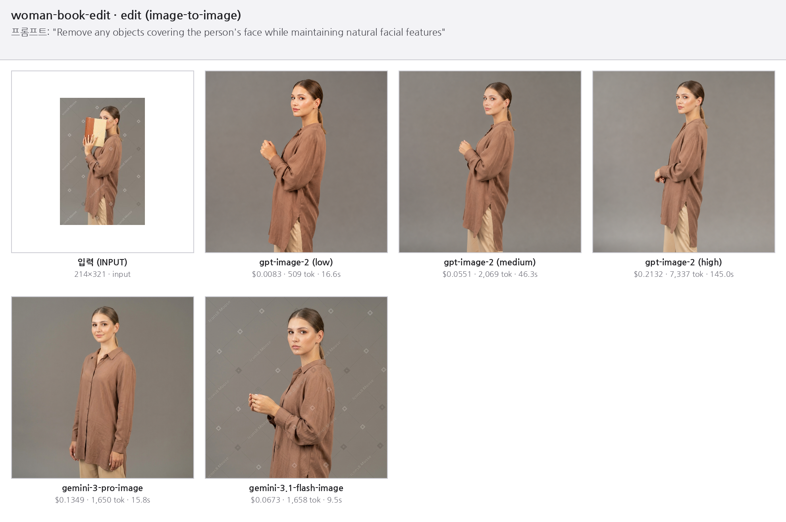
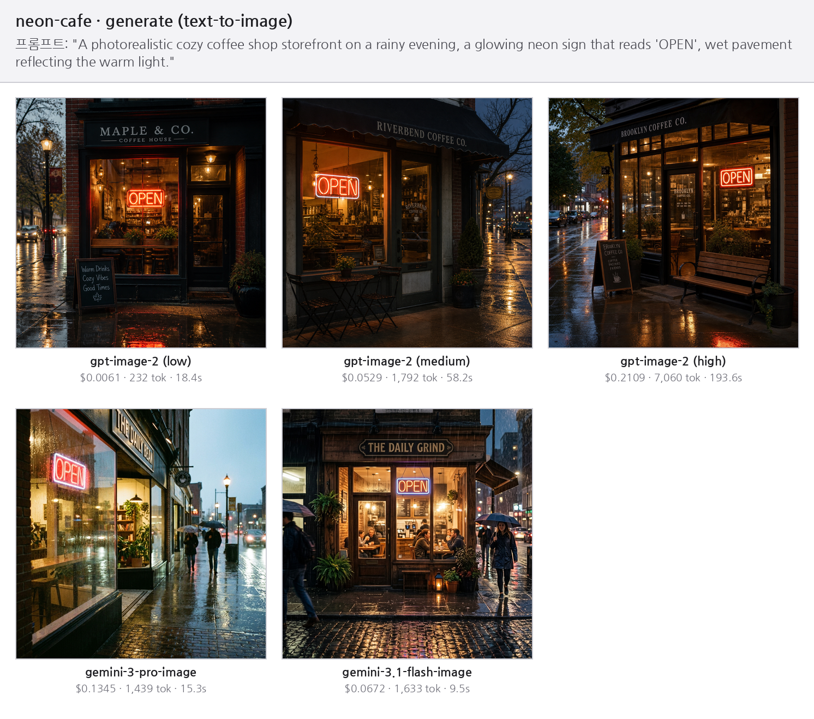

# OpenAI vs Gemini 이미지 생성/편집 비교

OpenAI와 Google Gemini 이미지 모델로 **이미지 생성·편집(image-to-image)**을 해보고, 응답의 **토큰 사용량으로 비용을 직접 계산**해 품질과 가격을 비교하는 실습입니다.

## ⚡ 요약 (Executive Summary)

**3개 케이스**(편집 2 + 생성 1)를 **5개 변형**(`gpt-image-2` low/medium/high + Gemini Pro/Flash)으로 돌려 **비용 · 소요시간 · 품질**을 비교했습니다.

### OpenAI vs Gemini — 품질 · 비용 · 응답 시간


| 관점        | OpenAI (`gpt-image-2`)                                                      | Google Gemini (`pro` · `flash`)                       |
| --------- | --------------------------------------------------------------------------- | ----------------------------------------------------- |
| **비용**    | quality 로 조절 — **$0.007**(low, 최저) ~ $0.21(high, 최고). 5종 중 유일하게 "가격 다이얼" 보유 | 모델별 고정 — flash **$0.067** · pro $0.135 (중간대, 조절 불가)   |
| **응답 시간** | quality 에 좌우 — ~17s(low) ~ **136–194s**(high, 가장 느림). low 에서만 속도 경쟁력        | 일관되게 빠름 — flash **~9s**(최速) · pro ~15s. 느린 구간이 없음     |
| **품질**    | high = 디테일·텍스트 렌더가 가장 강함. 편집 시 **장면을 크게 재구성**하는 경향(woman: 포즈까지 변경)          | 편집이 **국소적·원본 충실**(포즈·배경 유지, 책만 제거). flash 도 사진·텍스트 양호 |


**배수 비교 — `gemini-3.1-flash-image`(최저가·최速) = 1× 기준** · **3개 케이스 평균**(`cat-fullbody` · `woman-book-edit` · `neon-cafe`)


| 변형                       | 비용 (×Flash)        | 응답 시간 (×Flash) |
| ------------------------ | ------------------ | -------------- |
| `gpt-image-2` (low)      | **0.12×** (≈8배 저렴) | 1.9×           |
| `gpt-image-2` (medium)   | 0.8×               | 5.7×           |
| `gpt-image-2` (high)     | **3.2×**           | **17×**        |
| `gemini-3-pro-image`     | 2.0×               | 1.7×           |
| `gemini-3.1-flash-image` | 1× (기준)            | 1× (기준)        |


→ `gpt-image-2` (high) 는 Flash 대비 **비용 ~3.2배 · 시간 ~17배**. 반대로 (low) 는 **비용 ~1/8**(≈$0.007)인데 시간은 ~1.9배에 그칩니다. Pro 는 Flash 의 **비용 2배 · 시간 1.7배**.

*비용 배수는 세 케이스에서 거의 동일— 위 표는 그 평균입니다.*

**어떻게 고르나**

- ⚡ **속도·예측성** → `gemini-3.1-flash-image` (항상 ~9s, 고정가).
- 💸 **최저 비용** → `gpt-image-2` (low) — 단, flash 보다 ~2배 느립니다.
- 🔍 **최고 디테일·텍스트** → `gpt-image-2` (high) — 단, 느리고 비쌉니다.
- 🎯 **원본을 보존하는 국소 편집** → Gemini.
- 한 줄로: **OpenAI = 튜닝**(한 모델로 저가·고속 ↔ 고디테일을 오감) · **Gemini = 무조정 일관 속도**.

> 모든 수치는 응답 토큰에서 직접 산출한 실측값입니다 (2026-06-14).

---

**핵심 테스트 세트** (3개 모델 — 각각 생성·편집 모두 가능):


| 제공자    | 모델 ID                    | 티어       | 호출 방식                |
| ------ | ------------------------ | -------- | -------------------- |
| OpenAI | `gpt-image-2`            | flagship | `client.images.edit` |
| Gemini | `gemini-3-pro-image`     | Pro      | `generate_content`   |
| Gemini | `gemini-3.1-flash-image` | Flash    | `generate_content`   |


> 모델 선정 근거·가격·벤치마크 상세는 `[design/research_models_api.md](design/research_models_api.md)` 참고.

---

## 비교 결과 — 3개 케이스 × 5개 변형 (실측 2026-06-14)

각 케이스를 **OpenAI `gpt-image-2`(quality 3단계: low/medium/high)** 와 **Gemini 2종**으로 실행하고
**비용 · 소요시간 · 품질**을 비교했습니다. 표의 숫자는 실제 응답 토큰으로 계산한 실측값입니다.

> 몽타주 윗줄 = 입력(편집 시) + `gpt-image-2` quality 변형(low→medium→high), 아랫줄 = Gemini 모델.
>
> 표의 **토큰**은 합계(total)입니다. Gemini 는 그중 **이미지 토큰(~1,120)만** 과금되어, 비용이 토큰 합계에 비례하지 않습니다 (상세: 아래 «🧮 전체 계산 내역»).

### 1) `cat-fullbody` — 스케치 → 전신 고양이 (편집)


| 변형                       | 비용          | 소요시간     | 토큰    | 품질(관찰)                   |
| ------------------------ | ----------- | -------- | ----- | ------------------------ |
| `gpt-image-2` (low)      | **$0.0090** | 17.6s    | 597   | 라인아트 충실 — high와 차이 거의 없음 |
| `gpt-image-2` (medium)   | $0.0558     | 51.4s    | 2,157 | 라인아트, 약간 더 정돈            |
| `gpt-image-2` (high)     | $0.2139     | 136.3s   | 7,425 | 라인아트, 가장 매끈              |
| `gemini-3-pro-image`     | $0.1350     | 16.8s    | 1,699 | 컬러 일러스트로 재해석             |
| `gemini-3.1-flash-image` | $0.0673     | **8.4s** | 1,662 | 단순 카툰풍                   |


### 2) `woman-book-edit` — 얼굴 가린 책 제거 (편집/인페인팅)




| 변형                       | 비용          | 소요시간     | 토큰    | 품질(관찰)                |
| ------------------------ | ----------- | -------- | ----- | --------------------- |
| `gpt-image-2` (low)      | **$0.0083** | 16.6s    | 509   | 책 제거 + 인물 재구성(장면 재해석) |
| `gpt-image-2` (medium)   | $0.0551     | 46.3s    | 2,069 | 더 또렷, 여전히 장면 재해석      |
| `gpt-image-2` (high)     | $0.2132     | 145.0s   | 7,337 | 가장 정밀, 장면 재해석         |
| `gemini-3-pro-image`     | $0.1349     | 15.8s    | 1,650 | 책 제거, 분위기 강함          |
| `gemini-3.1-flash-image` | $0.0673     | **9.5s** | 1,658 | 책 제거, 원본 포즈에 가까움      |


### 3) `neon-cafe` — 텍스트→이미지 생성 ('OPEN' 간판)




| 변형                       | 비용          | 소요시간     | 토큰    | 품질(관찰)                     |
| ------------------------ | ----------- | -------- | ----- | -------------------------- |
| `gpt-image-2` (low)      | **$0.0061** | 18.4s    | 232   | 'OPEN' 가독 + 포토리얼 — low도 충분 |
| `gpt-image-2` (medium)   | $0.0529     | 58.2s    | 1,792 | 디테일 증가, 간판 또렷              |
| `gpt-image-2` (high)     | $0.2109     | 193.6s   | 7,060 | 가장 디테일·정밀                  |
| `gemini-3-pro-image`     | $0.1345     | 15.3s    | 1,439 | 무드 있는 거리, 'OPEN' 표현        |
| `gemini-3.1-flash-image` | $0.0672     | **9.5s** | 1,633 | 상호명까지 자연스럽게 렌더             |


## 🧮 전체 계산 내역 (토큰 × 단가 = 비용)

위 비교표의 모든 비용을 **토큰에서 직접 계산**한 내역입니다. 공식은 단순합니다 —
**비용 = (토큰 수 ÷ 1,000,000) × 단가**, 입력/출력을 각각 계산해 더합니다.
(토큰·단가 기초가 궁금하면 맨 아래 «💰 비용은 어떻게 계산하나요»를 참고하세요.)

- **OpenAI `gpt-image-2`** — 출력(이미지)은 `출력 토큰 × $30`(정확). 입력비는 텍스트($5)+이미지($8) 합산(편집) 또는 텍스트만(생성)이라 표엔 합산값(`→`)으로 적었습니다.
- **Gemini** — 입력은 `프롬프트 토큰 × 단가`(정확). 출력은 candidates 중 **IMAGE 모달리티 토큰(~1,120)** 만 과금하며, 표의 토큰 수는 비용에서 역산한 값(`≈`)입니다.

### `cat-fullbody` — 스케치 → 전신 고양이 (편집)


| 변형                       | 입력: 토큰 × 단가 = 비용           | 출력(이미지): 토큰 × 단가 = 비용         | 합계          |
| ------------------------ | -------------------------- | ----------------------------- | ----------- |
| `gpt-image-2` (low)      | 401 tok → $0.0031          | 196 tok × $30 = $0.0059       | **$0.0090** |
| `gpt-image-2` (medium)   | 401 tok → $0.0031          | 1,756 tok × $30 = $0.0527     | **$0.0558** |
| `gpt-image-2` (high)     | 401 tok → $0.0032          | 7,024 tok × $30 = $0.2107     | **$0.2139** |
| `gemini-3-pro-image`     | 277 tok × $2.0 = $0.000554 | ≈1,120 tok × $120.0 = $0.1344 | **$0.1350** |
| `gemini-3.1-flash-image` | 277 tok × $0.5 = $0.000139 | ≈1,119 tok × $60.0 = $0.0672  | **$0.0673** |


### `woman-book-edit` — 얼굴 가린 책 제거 (편집)


| 변형                       | 입력: 토큰 × 단가 = 비용           | 출력(이미지): 토큰 × 단가 = 비용         | 합계          |
| ------------------------ | -------------------------- | ----------------------------- | ----------- |
| `gpt-image-2` (low)      | 313 tok → $0.0024          | 196 tok × $30 = $0.0059       | **$0.0083** |
| `gpt-image-2` (medium)   | 313 tok → $0.0024          | 1,756 tok × $30 = $0.0527     | **$0.0551** |
| `gpt-image-2` (high)     | 313 tok → $0.0025          | 7,024 tok × $30 = $0.2107     | **$0.2132** |
| `gemini-3-pro-image`     | 273 tok × $2.0 = $0.000546 | ≈1,120 tok × $120.0 = $0.1344 | **$0.1349** |
| `gemini-3.1-flash-image` | 273 tok × $0.5 = $0.000137 | ≈1,119 tok × $60.0 = $0.0672  | **$0.0673** |


### `neon-cafe` — 'OPEN' 간판 생성 (text-to-image)


| 변형                       | 입력: 토큰 × 단가 = 비용          | 출력(이미지): 토큰 × 단가 = 비용         | 합계          |
| ------------------------ | ------------------------- | ----------------------------- | ----------- |
| `gpt-image-2` (low)      | 36 tok → $0.0002          | 196 tok × $30 = $0.0059       | **$0.0061** |
| `gpt-image-2` (medium)   | 36 tok → $0.0002          | 1,756 tok × $30 = $0.0527     | **$0.0529** |
| `gpt-image-2` (high)     | 36 tok → $0.0002          | 7,024 tok × $30 = $0.2107     | **$0.2109** |
| `gemini-3-pro-image`     | 29 tok × $2.0 = $0.000058 | ≈1,120 tok × $120.0 = $0.1344 | **$0.1345** |
| `gemini-3.1-flash-image` | 29 tok × $0.5 = $0.000015 | ≈1,120 tok × $60.0 = $0.0672  | **$0.0672** |


> 💡 **OpenAI 출력 토큰은 quality 가 결정** — low/medium/high = **196 / 1,756 / 7,024 토큰**으로 케이스(프롬프트·입력)와 **무관하게 일정**합니다. 출력 토큰이 곧 비용·속도를 좌우하므로, quality 한 단계가 가격을 약 6배씩 바꿉니다.

---

## 💰 비용은 어떻게 계산하나요? (초보자용)

> 가격은 자주 바뀝니다 — 고정(pin)하기 전에 [OpenAI 가격](https://developers.openai.com/api/docs/pricing) · [Gemini 가격](https://ai.google.dev/gemini-api/docs/pricing) 공식 페이지에서 다시 확인하세요.

### 1) "이미지 1장당 얼마"가 아니라 **토큰(token)** 단위로 과금

- **토큰** = AI가 글/이미지를 잘게 나눈 작은 조각.
- **입력 토큰** = 내가 보낸 것 (프롬프트 글자 + 입력 이미지)
- **출력 토큰** = AI가 만든 것 (생성된 이미지)

### 2) 가격은 보통 **"100만(1,000,000) 토큰당 $얼마"**로 공시

예) `gpt-image-2`의 출력 이미지 = **$30 / 1,000,000 토큰**.

### 3) 그래서 비용 공식은 단순합니다

```
비용($) = (토큰 수 ÷ 1,000,000) × (100만 토큰당 단가)
```

입력/출력, 텍스트/이미지처럼 종류가 나뉘면 **각각 계산해서 더합니다.**

### 4) 토큰 수는 "응답"에서 읽습니다 (API는 $금액을 안 줘요!)


| 제공자    | 어디서 읽나                    | 주요 필드                                                  |
| ------ | ------------------------- | ------------------------------------------------------ |
| OpenAI | `response.usage`          | `input_tokens`, `output_tokens` (+ 텍스트/이미지 세부)         |
| Gemini | `response.usage_metadata` | `prompt_token_count`(입력), `candidates_token_count`(출력) |


두 API 모두 달러 금액은 주지 않으므로, 위 공식으로 **직접 곱해서** 계산합니다. 이 일을 `src/generate_sample.py`가 자동으로 합니다.

### 단가표 (per 1,000,000 tokens · 2026-06-13 공식 확인)


| 모델                       | 입력 텍스트      | 입력 이미지 | 출력 이미지 |
| ------------------------ | ----------- | ------ | ------ |
| `gpt-image-2`            | $5          | $8     | $30    |
| `gemini-3-pro-image`     | 2 (입력 전체)   | —      | $120   |
| `gemini-3.1-flash-image` | 0.5 (입력 전체) | —      | $60    |


> Gemini는 입력의 텍스트와 이미지를 합쳐 하나의 입력 단가로 계산합니다.

### 직접 계산해보기 ① — `gemini-3.1-flash-image` (가장 단순)

```
입력 (프롬프트 + 스케치):   277 토큰 × $0.5 ÷ 1,000,000 = $0.000139
출력 (고양이 이미지):     1,120 토큰 × $60  ÷ 1,000,000 = $0.067200
──────────────────────────────────────────────────────────
합계                                                  ≈ $0.0673  ✅
```

### 직접 계산해보기 ② — `gpt-image-2`

```
출력 (이미지):        7,024 토큰 × $30 ÷ 1,000,000 = $0.2107
입력 (텍스트+스케치):    401 토큰  (텍스트 $5·이미지 $8) ≈ $0.0032
──────────────────────────────────────────────────────────
합계                                                ≈ $0.2139  ✅
```

## 빠른 시작

```bash
uv sync                                       # 의존성 설치
cp .env.example .env                          # OPENAI_API_KEY, GOOGLE_API_KEY 입력
uv run python src/generate_sample.py --list   # 케이스 목록 (API 호출 없음)
uv run python src/generate_sample.py          # 모든 케이스 × 3개 모델 + 비용 표
uv run python src/generate_sample.py cat-fullbody  # 한 케이스만 (비용 절약)
uv run python src/make_montage.py             # 케이스별 비교 뫽타주 생성
```

테스트 케이스(입력 이미지·프롬프트·모델)는 루트 `cases.toml` 에서 추가/수정합니다. `id` 가 `outputs/<id>/` 폴더 이름이 됩니다.

> ⚠️ Gemini 이미지 모델은 **무료 티어가 없습니다** — Google AI Studio에서 결제(유료 티어)를 활성화해야 동작합니다.

---

